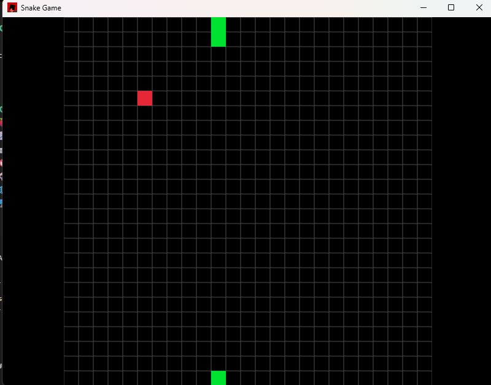

# Snake-Game

A classic Snake Game built in Rust using the macroquad crate.

## Features

- Smooth snake movement
- Random food spawning
- Snake grow when eats food
- Game over when snake hits itself or wall
- Responsive window size
- webassmbly support
- cross-platform suppport (Window, Linux, MacOs, WEB)

## ScreenShot
> Add a screenshot here.

